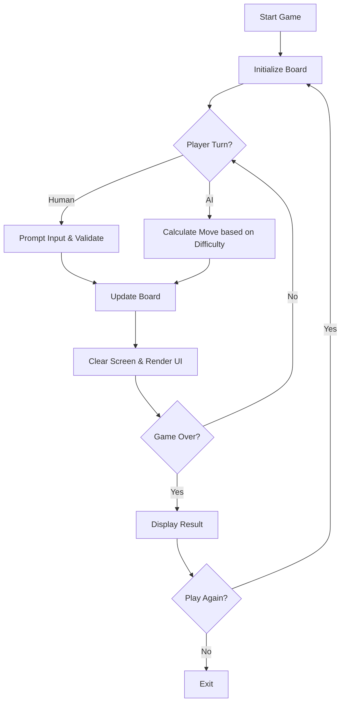

# Tic-Tac-Toe - Antigravity Agent
<!-- README.md team template, for use in new projects -->
## Project Description

A text-based Tic-Tac-Toe game written in Python 3.14.2 designed to evaluate agentic coding capabilities. The game features a retro terminal aesthetic inspired by Atari 1978 and a progressive AI that gets harder over time, supported by 100% test coverage.

## Estimated Cost

| Category | Description | Cost |
| --- | --- | --- |
| Development Labor | Agent-driven development | Agent Cost |
| AI Tokens | Google Deepmind Agent usage | Nominal |
| Production Hosting | n/a (local run only) | $0.00 |
| Other | n/a | $0.00 |
| TOTAL | | Nominal |

## Mockup
<!-- Placeholder for retro terminal mockups -->
_Terminal UI will feature clean screen clears and cool retro X's and O's structurally built out of characters rather than plain single characters._

## To Run

### In Your Local Environment

1. git clone this repo to a local project folder
2. CD into the repository and set up your python virtual environment: `python3 -m venv .venv` and source it `source .venv/bin/activate`
3. install necessary libraries: `pip install -r requirements.txt` (currently pytest is the main requirement)
4. run the game using `python main.py`

## Product Roadmap (Deliverables)

### MVP (Must Do)

- [x] Initialize the game board.
- [x] Implement the core game loop for human vs AI play.
- [x] Build progressive AI that starts easy (e.g. random moves) and increases in difficulty.
- [x] Implement robust win/draw condition checking.
- [x] Design and implement retro terminal styling (Atari 1978 look, structural X's and O's, screen clearing).
- [x] Implement a full unit test suite achieving 100% test coverage using `pytest`.
- [x] Document virtual environment instructions clearly.

### Stretch Goals (Should Do at some point)

- [ ] Human vs Human local multiplayer mode.
- [ ] Score tracking across multiple rounds.
  
### Super-Stretch Goals (Could Do at some point)

- [ ] Networked multiplayer via websockets.

### Out of Scope (Won't Do)

- Web-based GUI.
- Mathematically unbeatable AI from round 1.

## Design

### Flowchart (Program Logic Flow)

## Development Workflow

- [x] 1. Scaffold main project files (`main.py`, `board.py`, `ai.py`)
- [x] 2. Setup `pytest` environment and `requirements.txt`
- [x] 3. Implement Board rendering logic (retro UI)
- [x] 4. Implement core game logic (win checking, input validation)
- [x] 5. Implement AI logic (easy/random -> minimax)
- [x] 6. Write and run tests until 100% coverage is met
- [x] 7. END-TO-END TEST with Human interaction

## Reflection

| DATE | COMMENTS |
| ----------- | -------- |
| 2026-02-22 | Phase 1 & 2 Completed via Project Kickoff Workflow. Initial repository filled with standard files and PRD Lite generated. |

## References

- [Pytest Documentation](https://docs.pytest.org/en/latest/)
- [Minimax Algorithm](https://en.wikipedia.org/wiki/Minimax)
